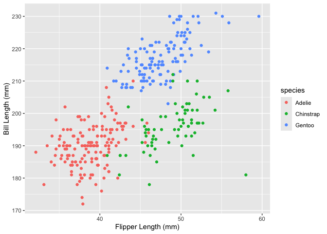

p8105_hw1_az2852
================

# Question 1

``` r
data("penguins", package = "palmerpenguins")
```

The penguins (344 rows × 8 columns) dataset contains flipper, bill, and
body mass data for Adelie, Gentoo, and Chinstrap penguins recorded in
2007-2009 from Torgersen Island, Biscoe Island, and Dream Island. Each
row is data for one penguin, including species, bill length, bill width,
flipper length, and body mass. The average flipper length for the
penguins in the dataset is
`mean(pull(penguins, flipper_length_mm), na.rm = TRUE)`

Below is a plot of flipper length agains bill length for the penguins in
the dataset (342 penguins and 2 missing values). The plot is divided
into three clusters when colored by species. Penguins of the same
species tend to have similar bill length and flipper length. For
example, Adelies in general have the shortest flippers and bills;
Chinstraps have the longest flippers; Gentoos have the longest bills.
The clusters are cleanly divided but there is some spread within each
cluster, showing considerable individual difference within the penguin
population. It also appears that there might be a positive correlation
between bill length and flipper length.

``` r
ggplot(penguins, aes(
  x = bill_length_mm,
  y = flipper_length_mm, 
  color = species)) + 
  geom_point()+
  labs(x = "Flipper Length (mm)", 
       y = "Bill Length (mm)" 
)
```

<!-- -->

# Question 2

Here we will explore variable types in R. First, we create a data frame
comprised of:

- a random sample of size 10 from a standard Normal distribution
- a logical vector indicating whether elements of the sample are greater
  than 0
- a character vector of length 10
- a factor vector of length 10, with 3 different factor “levels”

``` r
df = tibble(
  samp = rnorm(10),
  gtzero = samp > 0,
  vec_char = c("this", "vector", "will", "be", "of", "length", "10", "isn't", "it", "?"),
  vec_factor = factor(c("Small", "Medium", "Large", "Small", "Medium", "Large", "Small", "Medium", "Large", "Medium")),
)
```

You can take the mean of numeric variables.

``` r
mean(pull(df, samp))
```

    ## [1] -0.1627527

You may also take the mean of logical variables (which is just 0.5).

``` r
mean(pull(df, gtzero))
```

    ## [1] 0.4

But you cannot take the mean of character variables.

``` r
mean(pull(df, vec_char))
```

    ## Warning in mean.default(pull(df, vec_char)): argument is not numeric or
    ## logical: returning NA

    ## [1] NA

You cannot take the mean of factor variables.

``` r
mean(pull(df, vec_factor))
```

    ## Warning in mean.default(pull(df, vec_factor)): argument is not numeric or
    ## logical: returning NA

    ## [1] NA

We can try and convert variable types into numeric.

- Converting factors into numeric will show their levels.
- Converting characters into numeric will not give you an answer unless
  the characters are numbers.
- Converting logicals into numeric will give you 1s and 0s.

``` r
as.numeric(pull(df, vec_factor))
as.numeric(pull(df, vec_char))
as.numeric(pull(df, gtzero))
```
